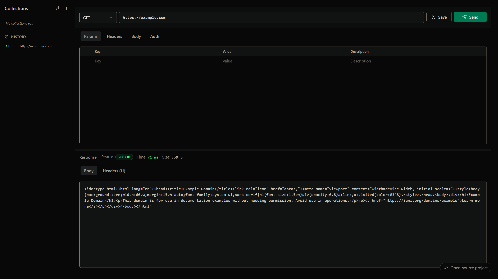

# QuickPost


> A fast, privacy-first, open-source API Client built for modern web developers.

**Live Demo:** [quickpost.partyka.pro](https://quickpost.partyka.pro)



QuickPost is a lightweight, distraction-free REST API client alternative to Postman. Built with speed and developer experience in mind, it allows you to compose HTTP requests, inspect responses in real-time, bypass browser CORS restrictions via Next.js Server Actions, and organize your API collections—all with local-first privacy.

---

## Features

- **Lightning Fast & Modern UI**: Sleek dark mode design optimized for productivity without bloated background services.
- **Full Request Builder**: Support for GET, POST, PUT, DELETE, PATCH, custom headers, query params, and JSON/Form-data body payloads.
- **Response Inspector**: Detailed HTTP status badges, response execution timing (in ms), payload size, formatted JSON viewer, and headers breakdown.
- **CORS Proxy via Server Actions**: Solve web browser CORS limitations seamlessly using Next.js Server Actions.
- **Built-in Rate Limiting**: Server Action protection preventing proxy abuse (IP-based limit).
- **Collections & Local History**: Automatically persist past requests locally in your browser storage.
- **Authentication Helpers**: Native support for Bearer Tokens, Basic Auth, and API Keys.

---

## Tech Stack

| Category | Technology |
| :--- | :--- |
| **Framework** | [Next.js 16](https://nextjs.org/) (App Router, Server Actions & React 19) |
| **Language** | [TypeScript](https://www.typescriptlang.org/) |
| **Styling** | [Tailwind CSS v4](https://tailwindcss.com/) |
| **Testing** | [Vitest](https://vitest.dev/) |
| **Icons** | [Lucide React](https://lucide.dev/) |

---

## Getting Started

### Docker (GitHub Packages)

You can pull and run the pre-built image directly from the GitHub Container Registry:

```bash
docker run -p 3000:3000 -d ghcr.io/zenopar/quickpost:latest
```

*Note: By default, requests to local APIs and `localhost` are allowed. Add `-e ALLOW_LOCAL_REQUESTS=false` to your docker run command to block them.*

### Local Development

First, clone the repository and install dependencies:

```bash
git clone https://github.com/zenopar/QuickPost.git
cd QuickPost
npm install
```

**Environment Setup:**
Copy the example environment file:

```bash
cp .env.example .env.local
```

*(Optional) By default, requests to local APIs and `localhost` are allowed (`ALLOW_LOCAL_REQUESTS=true`). Set `ALLOW_LOCAL_REQUESTS=false` in `.env.local` if you wish to block requests to private/local networks.*

Run the development server:

```bash
npm run dev
```

Run the test suite:

```bash
npm test
```

Open [http://localhost:3000](http://localhost:3000) in your browser to start using QuickPost.

---

## License

Distributed under the MIT License. See [`LICENSE`](LICENSE) for more information.